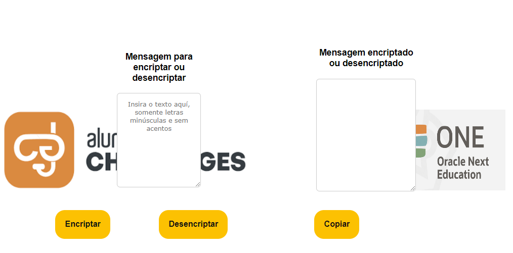

# Challenge_Encriptador_Alura_ONE
Resumo do Projeto de Criptografia e Descriptografia
Este projeto é um exemplo de aplicação web desenvolvida como parte do programa ONE NEXT Educação. Ele inclui criptografia e descriptografia de mensagens, com um design visual aprimorado e uma interface interativa. A aplicação é composta por HTML, CSS e JavaScript, e tem como objetivo ensinar conceitos básicos de criptografia, além de demonstrar habilidades de desenvolvimento web.

1. Estrutura HTML
O HTML define a estrutura da aplicação e inclui:

Área de Entrada: Um campo de texto onde o usuário pode digitar a mensagem a ser criptografada ou descriptografada.
Botões de Ação: Três botões que permitem ao usuário encriptar, desencriptar e copiar o texto.
Área de Saída: Um campo de texto onde a mensagem encriptada ou desencriptada é exibida.
Os elementos HTML são organizados em contêineres para facilitar o layout e a posição dos componentes na página.

2. Estilo CSS
O CSS é responsável pela aparência visual da aplicação:

Estilos Globais: Configura margens, preenchimentos e o modelo de caixa para garantir um layout consistente.
Layout da Página: Define o posicionamento e o tamanho dos elementos, incluindo a área de entrada e os botões.
Estilo dos Botões: Personaliza a aparência dos botões com cores, bordas arredondadas e efeitos de transição para melhorar a interatividade.
Layout Responsivo: Utiliza flexbox e posicionamento absoluto para garantir que a aplicação seja exibida corretamente em diferentes tamanhos de tela.
3. Funcionalidade JavaScript
O JavaScript adiciona interatividade à aplicação:

Função de Criptografia (encriptar): Transforma a mensagem inserida em uma sequência de caracteres substituídos por códigos específicos, como "a" sendo substituído por "ai".
Função de Descriptografia (desencriptar): Reverte a criptografia, convertendo os códigos de volta para os caracteres originais.
Função de Cópia (copiar): Permite copiar o texto exibido na área de saída para a área de transferência.
Estas funções manipulam o DOM para obter valores dos campos de entrada, aplicar transformações e atualizar a interface do usuário.

Importância do Projeto
Educação sobre Criptografia: Serve como uma introdução prática aos conceitos básicos de criptografia e descriptografia, mostrando como os dados podem ser transformados e revertidos.
Desenvolvimento Web: Demonstram a integração de HTML, CSS e JavaScript para criar uma aplicação web funcional e interativa.
Experiência do Usuário: Proporciona uma interface limpa e intuitiva, facilitando a interação com a aplicação.
Conexão com Empresas e Programas de Educação
Este projeto é parte do ONE NEXT Educação, uma iniciativa promovida por empresas como Alura e Oracle. O programa ONE NEXT visa capacitar os participantes com habilidades práticas em desenvolvimento e outras áreas tecnológicas. A Alura e a Oracle, com suas respectivas experiências em educação e tecnologia, oferecem suporte e recursos para aprimorar o aprendizado dos participantes, preparando-os para o mercado de trabalho e para futuros desafios em tecnologia.

## Imagem do Decodificador em Ação

